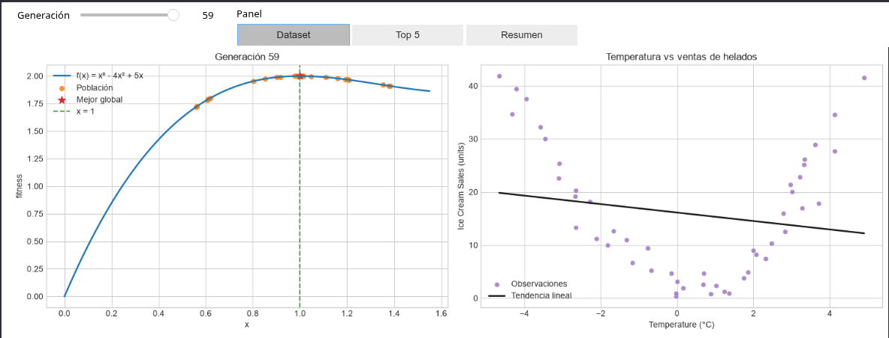
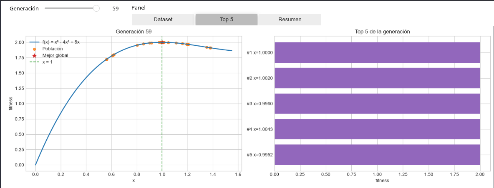
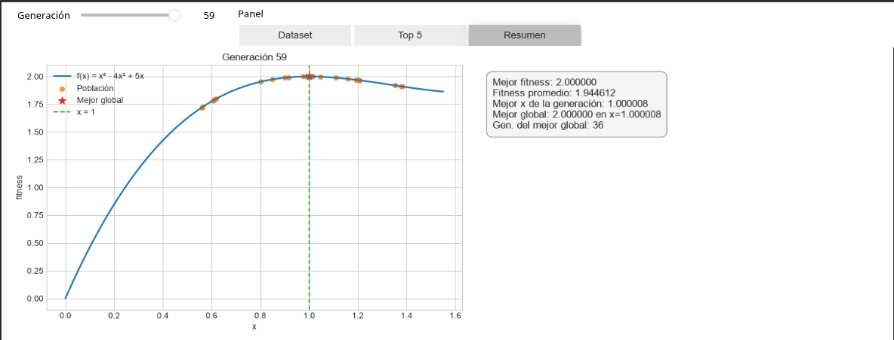

# Maximizacion Cubica con Algoritmos Geneticos

Proyecto de trabajo para los ejercicios de Algoritmos Geneticos, enfocado en maximizar la funcion $f(x) = x^3 - 4x^2 + 5x$ con una implementacion didactica en Python.

## Autor y tutor

| Rol | Nombre |
|---|---|
| Autor | Jorge Nicolas Castro Ballesteros - jncastro@.. |
| Tutor | Fabio Alejandro Sastoque Rincon |
| Universidad | Universidad de Cundinamarca - Seccional Ubate |

## Proyecto

- [max_cubica.ipynb](max_cubica.ipynb): notebook principal con el algoritmo genetico, la decodificacion binaria y las graficas de convergencia.
- [clase_1_ag.py](clase_1_ag.py): archivo de referencia para la estructura general del algoritmo.
- [Dataset/Ice_cream selling data.csv](Dataset/Ice_cream%20selling%20data.csv): dataset de contexto visual usado en las graficas finales.

## Tecnologias

 Tecnologia y entorno

  
  
 
  
  
 

## Como ejecutar

```bash
python3 -m venv .venv
source .venv/bin/activate
pip install numpy pandas matplotlib ipywidgets ipykernel
```

Luego abre [max_cubica.ipynb](max_cubica.ipynb), selecciona el kernel de `.venv` y ejecuta las celdas en orden.

## Capturas

1. Generacion y tabla principal




2. Top 5 y comparacion





3. Resumen final:



## Notas

- el notebook esta pensado para un flujo simple y claro para entender el tema lo mejor posible
- las figuras finales ayudan a leer la evolucion del AG y el resultado de la busqueda


