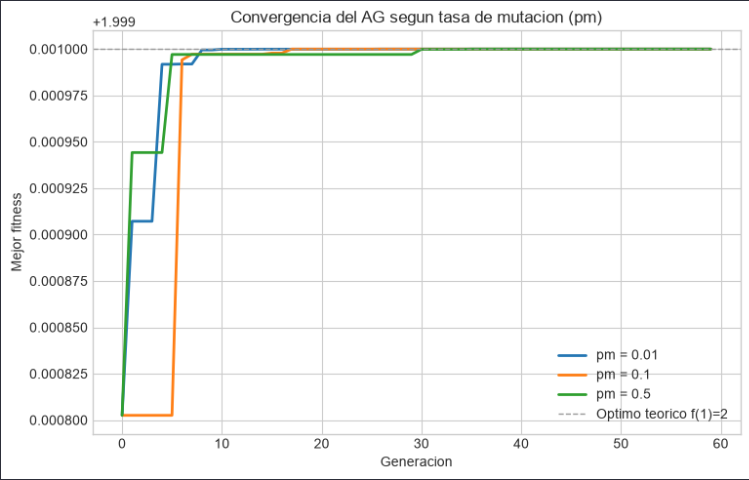
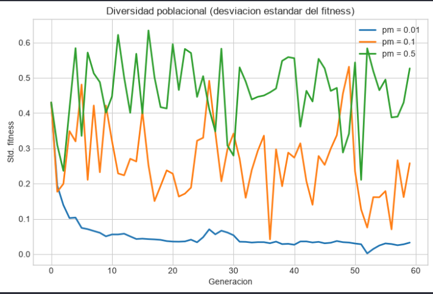

# Impacto de la Tasa de Mutacion en Algoritmos Geneticos

Proyecto de trabajo para los ejercicios de Algoritmos Geneticos, enfocado en analizar como la tasa de mutacion `pm` afecta la convergencia y la diversidad poblacional al maximizar $f(x) = x^3 - 4x^2 + 5x$, usando la misma implementacion del Ejercicio 1.

## Autor y tutor

| Rol | Nombre |
|---|---|
| Autor | Jorge Nicolas Castro Ballesteros - jncastro@.. |
| Tutor | Fabio Alejandro Sastoque Rincon |
| Universidad | Universidad de Cundinamarca - Seccional Ubate |

## Proyecto

- [tasa_mutacion.ipynb](tasa_mutacion.ipynb): notebook principal del Ejercicio 3, corre el AG tres veces (pm = 0.01, 0.1 y 0.5), genera las graficas comparativas de convergencia y diversidad, y tiene el analisis de resultados.
- [max._cubica.ipynb](max._cubica.ipynb): notebook del Ejercicio 1 donde vive la clase `AlgoritmoGenetico` base que se reutiliza aqui.
- [clase_1_ag.py](clase_1_ag.py): archivo de referencia para la estructura general del algoritmo.
- [Dataset/Ice_cream selling data.csv](Dataset/Ice_cream%20selling%20data.csv): dataset de contexto visual usado en las graficas del Ejercicio 1.

## Tecnologias

 Tecnologia y entorno

  
  
 
  
  
 


 ## Como ejecutar

```bash
python3 -m venv .venv
source .venv/bin/activate
pip install numpy pandas matplotlib ipywidgets ipykernel
```

Luego abre [tasa_mutacion.ipynb](tasa_mutacion.ipynb), selecciona el kernel de `.venv` y ejecuta las celdas en orden.

## Que se hizo en el codigo

En el notebook [tasa_mutacion.ipynb](tasa_mutacion.ipynb) monte el Ejercicio 3 de impacto de la tasa de mutacion. La meta era correr el mismo AG del Ejercicio 1 (que maximiza f(x) = x³ - 4x² + 5x en el rango [0.0, 1.55]) tres veces cambiando **unicamente** el valor de `pm` (0.01, 0.1 y 0.5), dejando todos los demas parametros fijos, para ver como eso afecta la convergencia y la diversidad de la poblacion.

### Funciones y clase que use

- `fitness_cubica(x)`: misma funcion de aptitud del Ejercicio 1, devuelve el valor de la funcion objetivo.
- `decode_binary_to_real()`: traduce un cromosoma de 16 bits a un valor real dentro del rango [0.0, 1.55].
- `ejecutar_ag(pm, seed=42)`: funcion parametrizable que instancia y corre el AG completo para un valor de `pm` dado, fijando la misma semilla en las tres corridas para aislar el efecto de `pm`. Devuelve el historial de convergencia, el resumen de resultados y el numero de individuos unicos en la poblacion final.

### Clase AlgoritmoGenetico

Se reutilizo tal cual la clase del Ejercicio 1. Como novedad para este ejercicio, cada fila del historial ahora tambien registra `std_fitness` (la desviacion estandar del fitness de toda la poblacion en esa generacion), que se usa como medida de **diversidad poblacional** para comparar el efecto de `pm`. Corre 60 generaciones con 40 individuos, pc=0.85, seleccion por ruleta y elitismo activo.

### Loop comparativo


```bash
valores_pm = [0.01, 0.1, 0.5]
for pm_valor in valores_pm:
    resultado = ejecutar_ag(pm=pm_valor, seed=42)

```

Con eso se consolida un DataFrame con el historial de las tres corridas y se genera la tabla resumen comparativa.

### Resultado y visualizacion

Al correrlo las tres tasas llegaron al mismo optimo global (x ≈ 1, f(x) = 2.0), pero con diferencias claras en velocidad de convergencia y diversidad:

| pm | mejor x | generacion | individuos unicos |
|---|---|---|---|
| 0.01 | 0.999961 | 29 | 33 |
| 0.10 | 1.000008 | 17 | 38 |
| 0.50 | 0.999866 | 35 | 40 |

- **pm = 0.1** fue la mas rapida para encontrar el optimo (generacion 17). Una mutacion moderada ayuda a explorar rapido sin destruir buen material genetico.
- **pm = 0.01** converge mas lento (gen 29) pero la poblacion queda muy homogenea al final (33 individuos unicos, poco diversa).
- **pm = 0.5** introduce tanto ruido que tambien tarda mas (gen 35), pero mantiene alta diversidad (toda la poblacion con individuos unicos al final).
- El fitness promedio de la poblacion baja a medida que sube `pm` (1.953 → 1.840 → 1.654), porque con mucha mutacion muchos individuos se alejan del optimo cada generacion aunque el mejor se preserve por elitismo.

Las capturas de abajo corresponden a la grafica comparativa de convergencia y al panel de diversidad poblacional cuando corres el notebook completo.


## Capturas

4. Convergencia segun tasa de mutacion




5. Diversidad poblacional (desviacion estandar del fitness)



## Notas

- el notebook esta pensado para entender el efecto de `pm` de forma visual y cuantitativa
- las tres corridas usan la misma semilla (seed=42) para que la unica variable que cambie sea `pm`
- el elitismo activo garantiza que el mejor individuo nunca se pierde, por eso las tres tasas llegan al mismo optimo aunque con velocidades distintas


